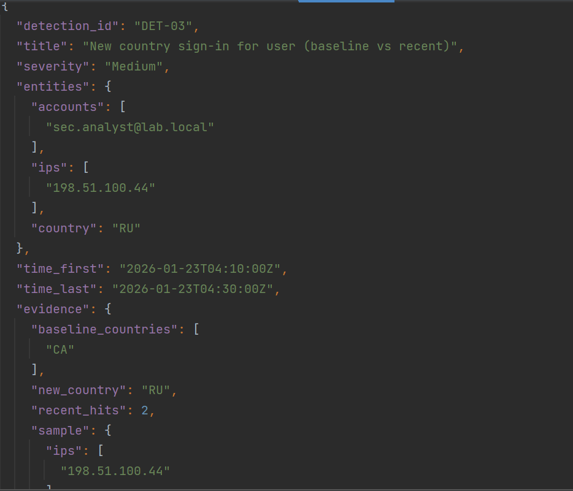
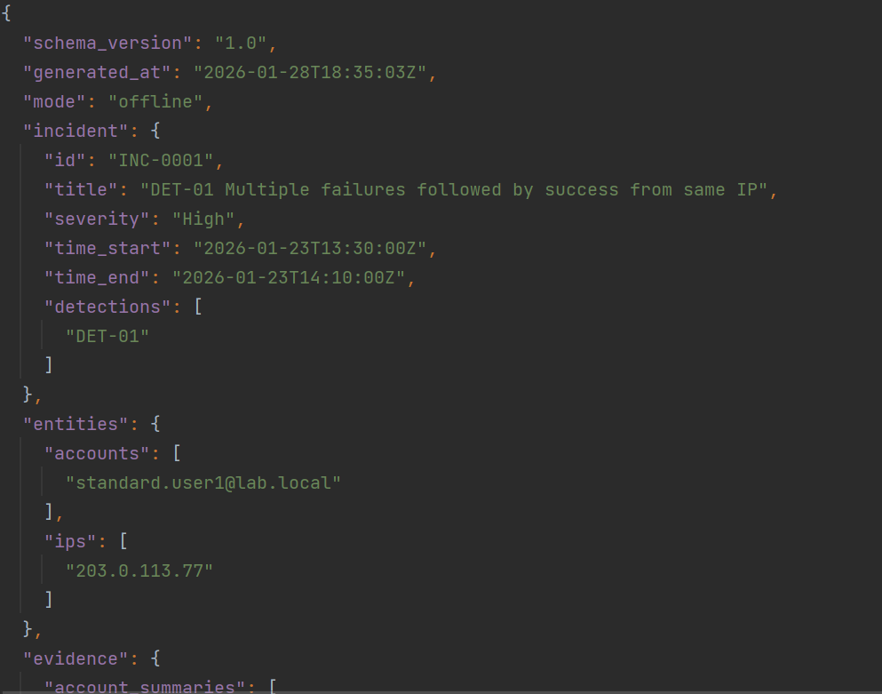
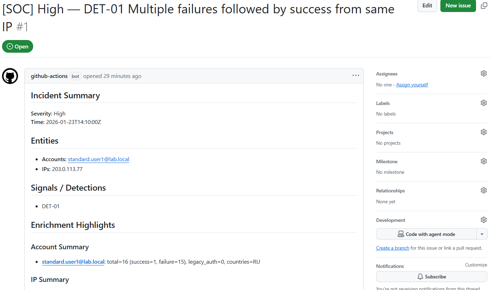
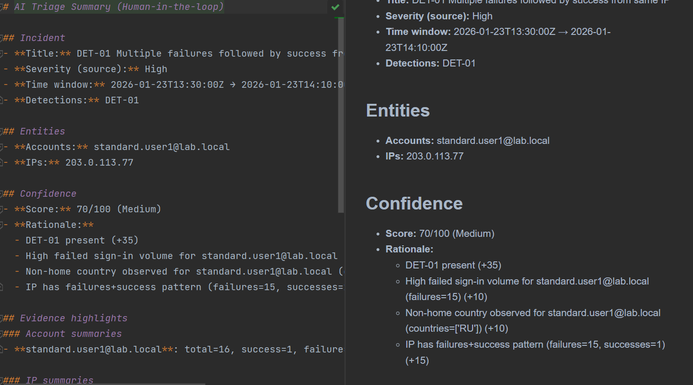

# Identity Threat Detection & Response Lab (Sentinel + Entra ID)  
## Optional AI Triage Summary (Human-in-the-loop)

A production-minded, portfolio-grade identity detection and response lab that mirrors how a SOC teams works with Microsoft Entra ID telemetry and Microsoft Sentinel patterns. This repo is designed to be valuable even without Azure access by providing an offline-first “detection - investigation - SOAR ticket - triage summary” pipeline you can run locally.

---

## What this project demonstrates

### Enterprise outcomes 
- Built a complete identity-focused detection & response pipeline using Entra-shaped telemetry (SigninLogs + AuditLogs), KQL-style detections, investigation workflow, and SOAR-safe automation design.
- Authored a reusable investigation workbook spec and panel queries that align to a SOC investigation flow.
- Implemented a reproducible offline harness that generates realistic telemetry, runs detections, and outputs incidents/alerts as artifacts.
- Automated incident ticketing in a safe way (enrichment + documentation only), plus a manual-only containment playbook design.
- Added an optional “AI triage summarizer” that produces structured incident summaries with confidence scoring (no autonomous containment).

### What it does 
Generates Entra identity telemetry, detects high-signal identity threats, packages investigation evidence, creates a SOC ticket, and produces an analyst triage summary — all locally, at zero cost.

---

## Stack and concepts
- Microsoft Entra ID telemetry (SigninLogs, AuditLogs schema)
- Microsoft Sentinel concepts: Analytics rules, Incidents, Workbooks, Entities
- KQL detection engineering + tuning + MITRE mapping
- SOAR design patterns (Logic Apps playbooks): safe enrichment + ticketing; manual-only containment
- Python automation: offline enrichment bundle generator + GitHub dispatch payload builder
- Optional “AI” module: deterministic triage summarizer (human approval model)

---

## Repository highlights (the recruiter tour)
- `detections-kql/`  
  7 documented detections (DET-01..DET-07), each with KQL, tuning notes, false positives, and MITRE mapping.
- `workbooks/identity-investigations/`  
  A SOC-style “Identity Investigations” workbook spec plus panel query library (overview, drilldowns, and pivots).
- `playbooks-soar/`  
  Two playbook specs and diagrams:
  - PB-01: Enrich & Ticket (safe automation)
  - PB-02: Manual Containment (human-approved only)
  Includes an end-to-end GitHub Issue ticket flow (repository_dispatch → issue creation).
- `enrichment-graph/`  
  Investigation bundle generator producing structured JSON evidence to support triage and incident response.
- `ai-triage-summarizer/`  
  Human-in-the-loop triage summary generator that outputs confidence score + rationale + recommended actions.
- `tools/local-kql/`  
  Offline harness that generates sample telemetry and runs detection logic, outputting alerts and incident contexts.
- `case-study/`  
  Production-style incident report that ties all components into a single narrative.

---

## Architecture (offline-first pipeline)
This repo implements the same flow used in many Sentinel/Entra SOC environments, but locally:

1. Generate Entra-shaped telemetry (SigninLogs + AuditLogs)
2. Run high-signal detections (DET-01..DET-07)
3. Emit alert artifacts + incident context objects
4. Build an investigation bundle (JSON) for evidence packaging
5. Create a SOC ticket (GitHub Issue) via dispatch payload and workflow
6. Generate an AI-style triage summary (human decision model)

---

## Screenshots (real outputs from this repo)

### Alerts generated from the offline detection harness


### Investigation bundle produced by the enrichment tool


### SOAR-style ticket creation (GitHub Issue) with enrichment highlights


### Human-in-the-loop triage summary with confidence scoring


---

## Detections included (DET-01..DET-07)

Each detection has:
- purpose and threat hypothesis
- KQL query (Sentinel-ready style)
- tuning and false-positive guidance
- MITRE mapping

Detections:
- **DET-01** Multiple failures followed by success from same IP (high signal credential attack pattern)
- **DET-02** Legacy Authentication sign-in detected
- **DET-03** New country sign-in for user (baseline vs recent)
- **DET-04** Privileged role assignment / role membership change
- **DET-05** Application / service principal credentials added or updated
- **DET-06** OAuth consent granted to application
- **DET-07** MFA method / security info changed

See: `detections-kql/`

---

## Workbook: Identity Investigations view
A SOC-oriented workbook spec that supports:
- overview KPIs and trends
- detection drilldowns mapped to DET-01..DET-07
- investigation pivots (User timeline and Audit timeline)

See:
- `workbooks/identity-investigations/workbook-spec.md`
- `workbooks/identity-investigations/panels/`

---

## SOAR playbooks (safe, production-minded)
This repo intentionally avoids risky autonomous containment.

- **PB-01 Enrich & Ticket (Automatic, Safe)**
  - extracts entities (UPN/IP)
  - runs enrichment queries (concept pack)
  - builds an investigation bundle
  - creates a ticket and posts structured context

- **PB-02 Manual Containment (Manual trigger only)**
  - provides an analyst checklist and approval trail
  - containment actions are documented as manual-only

See:
- `playbooks-soar/PB-01-enrich-and-ticket/`
- `playbooks-soar/PB-02-manual-containment/`
- shared enrichment query pack: `playbooks-soar/_shared/enrichment-queries.md`

---

## SOC Runbook (how this would be operated in production)
This repo includes a SOC-style runbook that documents the operating procedure for triaging and investigating identity alerts using the workbook, detections, enrichment bundle, and SOAR playbooks. It covers:

- Priority/severity model for DET-01..DET-07
- 10–15 minute triage workflow (validate → workbook context → pivot path)
- Investigation playbooks per detection (DET-01..DET-07)
- Evidence checklist for incident documentation
- Safe automation vs manual-only containment rules
- Closure criteria and tuning guidance

See: `docs/runbook.md`


---

## Case study
A production-style incident report that walks through:
alert → triage → investigation pivots → decision model → response recommendations → artifacts

See: `case-study/INC-0001-entra-identity-compromise.md`

---

## Run the full demo locally (zero cost)

### Prerequisites
- Python 3.10+ (Windows/macOS/Linux)
- No Azure subscription required

### 1) Generate sample logs
```powershell
python tools\local-kql\generate_sample_logs.py

```
Output files:
```
data/sample-logs/SigninLogs.jsonl
data/sample-logs/AuditLogs.jsonl
```

---

## 2. Run Detections and Emit Alerts + Incident Contexts

```bash
python tools\local-kql\run_detections.py
```

Outputs:
```
data/demo-output/alerts.json
data/demo-output/incident_contexts/INC-0001.json (and others)
```

---

## 3. Build an Investigation Bundle (Evidence Packaging)

```bash
python enrichment-graph/src/main.py
```

Output:
```
enrichment-graph/sample-output/investigation-bundle.sample.json
```

---

## 4. Build the Ticket Dispatch Payload

```bash
python enrichment-graph/src/make_github_dispatch_payload.py
```

Output:
```
enrichment-graph/sample-output/github-dispatch-payload.json
```

---

## 5. Generate a Triage Summary (Human-in-the-Loop)

```bash
python ai-triage-summarizer/src/summarize.py
```

Output:
```
ai-triage-summarizer/sample-output/triage-summary.sample.md
```

---

## Optional: Create a GitHub Ticket Automatically

This repository includes a GitHub Actions workflow that creates a GitHub Issue upon receiving a `repository_dispatch` event.

Workflow file:
```
.github/workflows/create_ticket_from_dispatch.yml
```

Use the generated payload from:
```
enrichment-graph/sample-output/github-dispatch-payload.json
```

---

**Note:** Keep API tokens and credentials private. **Do not commit sensitive information.**

# Additional Details: Governance, Safety, and Microsoft Integration

---

## Safety and Governance Model

- Automation is designed to be safe by default: enrichment, documentation, routing.
- Containment is manual-only and explicitly approval-based.
- The AI module provides summaries and confidence rationale but does not execute actions.

This mirrors real security governance expectations in regulated environments.

---

## Mapping to Microsoft Environments

If you use or plan to use **Microsoft Sentinel**, this repo is structured to be directly portable:

- KQL detections can be imported as Analytics rules.
- Workbook spec/panels translate into a Sentinel Workbook.
- Playbook specs translate into Logic Apps playbooks (exportable as JSON).
- Enrichment tool can evolve from offline provider to live Microsoft Graph provider without changing the output schema.

---

## Project Layout

```
detections-kql/                     KQL rules, docs, MITRE mapping (DET-01..DET-07)
workbooks/identity-investigations/  Workbook spec + panel queries
playbooks-soar/                     SOAR playbook specs + diagrams + shared query pack
docs/                               SOC runbook describing the standard operating procedure for triaging
enrichment-graph/                   Investigation bundle generator + dispatch payload builder
ai-triage-summarizer/               Human-in-the-loop triage summary generator
tools/local-kql/                    Sample telemetry generator + detection runner
case-study/                         Incident report + screenshots
data/                               Generated logs + demo outputs
```
